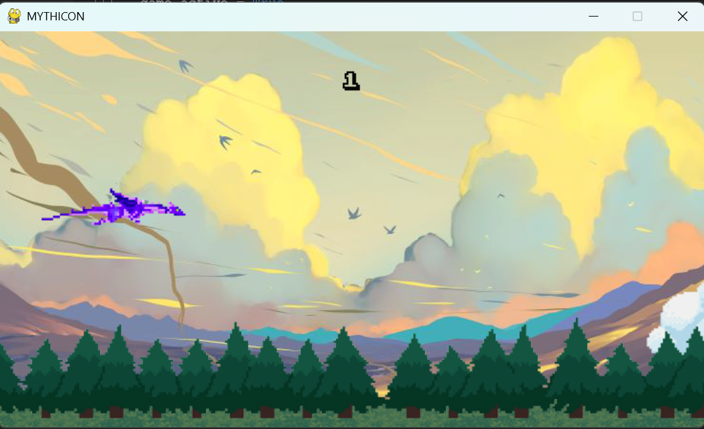
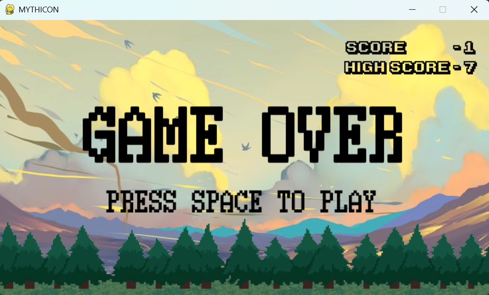

# MYTHICON- PYGAME inspired by flappy bird
A mini group project done in python and mysql(now sqlite).

## Game Lore!

In the mystical realm of Mythicon, a dragon finds herself ensnared within an enchanted forest, unable to break free. 
Players must guide the dragon through the perilous forest, evading menacing dark clouds imbued with dark magic and dodging towering trees.
Only by mastering the art of flight can the dragon soar to freedom and reclaim its place in the skies.

## Features

- Flappy Bird-style gameplay with a fantasy twist.
- animated wing flag and  sound effects.
- Leaderboard system to track high scores using sqlite db.

## How to Play
-Press the spacebar or left mouse button to make the dragon flap its wings and ascend.

-Release the spacebar or mouse button to descend.

-Navigate the dragon through the gaps between the trees and clouds.

-Avoid colliding with the trees or clouds, as it will end the game.

-Aim to achieve the highest score and make it to the top of the leaderboard.

## Installation

1. Make sure you have Python installed on your system. You can download it from [here](https://www.python.org/downloads/).
2. Install pygame and tkinter modules.
3. clone the repo and run _python loginpage.py_ in terminal.

